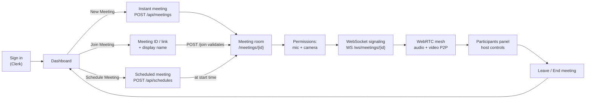
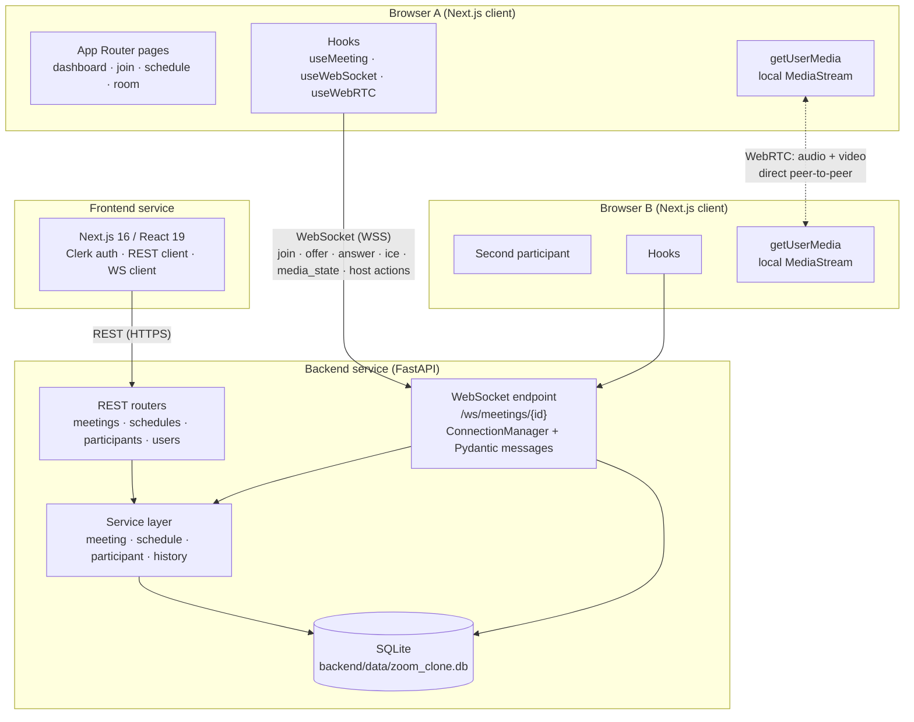
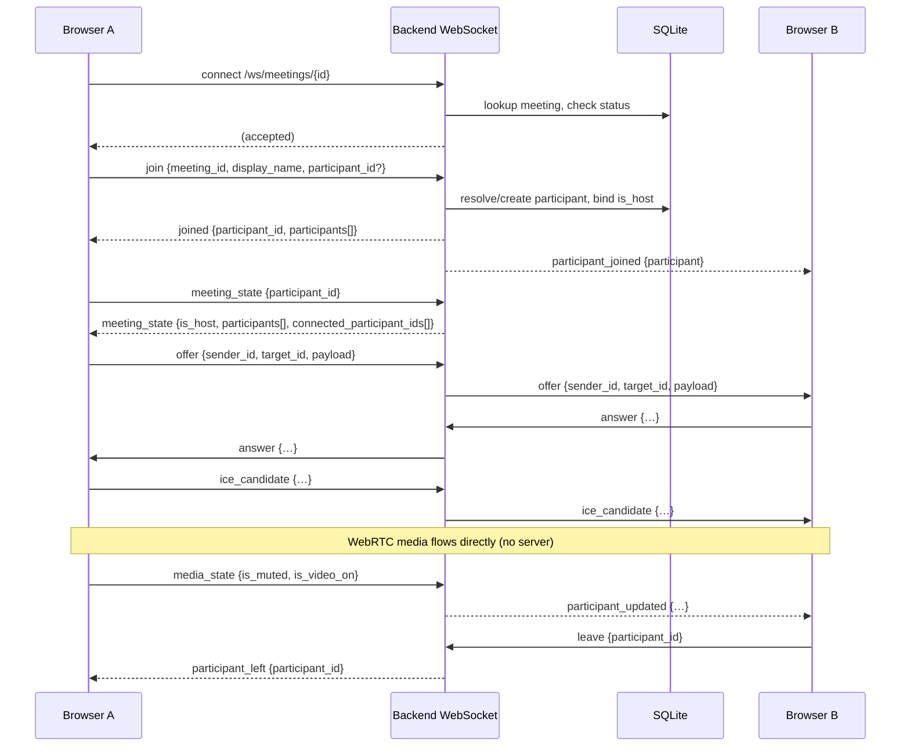
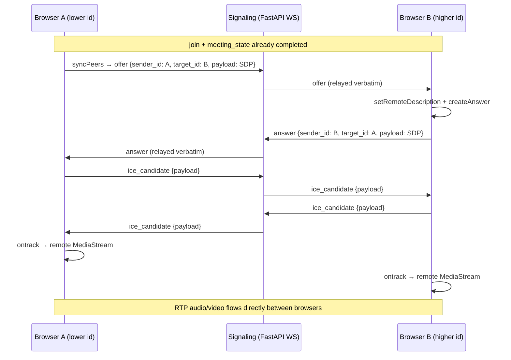
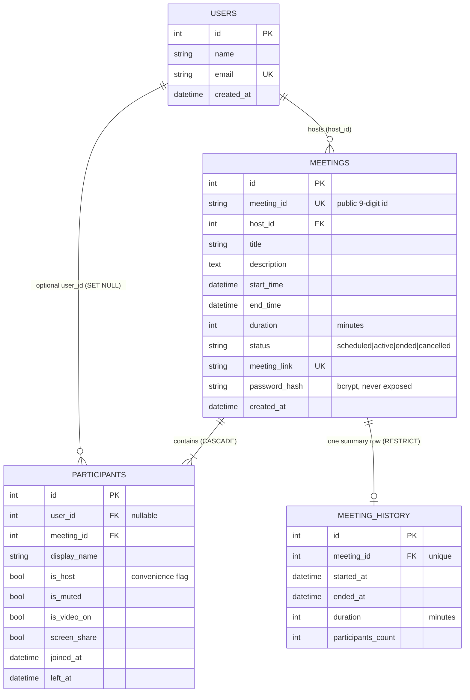
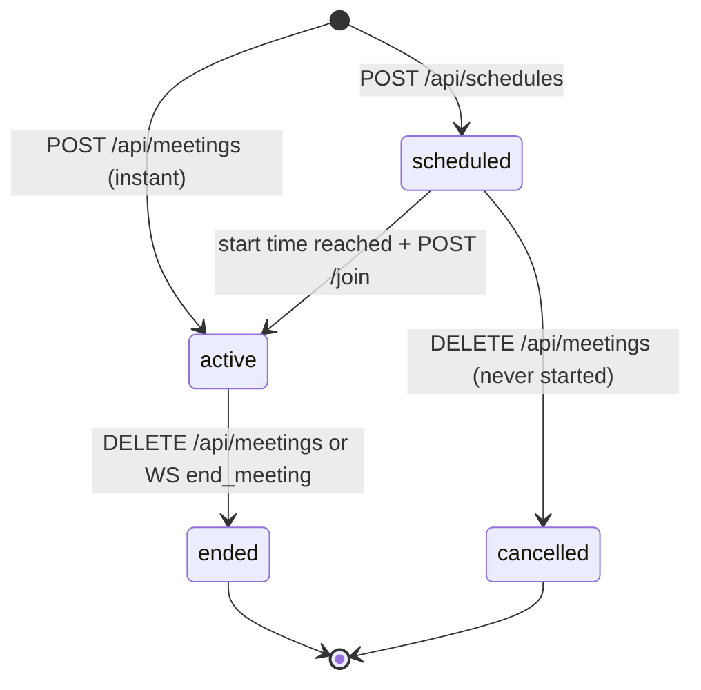

# Scalar Zoom Clone

**A modern full-stack video conferencing platform inspired by Zoom's interaction patterns and workflows — sign in, start an instant meeting, share a nine-digit ID or invite link, schedule for later, and meet in a live browser-to-browser room with host controls.**

[](https://github.com/prnvvv/ScalarZoomClone/actions/workflows/ci.yml)


> The in-app brand renders as **Zoom** (`APP_NAME` in `frontend/src/lib/constants.ts`); the repository, package metadata (`scalarzoomclone`) and API title (*Scalar Meeting API*) use the Scalar names.

---

## Contents

- [Live Demo](#live-demo)
- [Demo Credentials](#demo-credentials)
- [Product Overview](#product-overview)
- [Product Workflow](#product-workflow)
- [Key Features](#key-features)
- [Product Demo](#product-demo)
- [Architecture](#architecture)
- [System Design](#system-design)
- [Tech Stack](#tech-stack)
- [Project Structure](#project-structure)
- [Frontend Architecture](#frontend-architecture)
- [Backend Architecture](#backend-architecture)
- [REST API Overview](#rest-api-overview)
- [WebSocket / Realtime Architecture](#websocket--realtime-architecture)
- [WebRTC Architecture](#webrtc-architecture)
- [Authentication](#authentication)
- [Database Design](#database-design)
- [Meeting Lifecycle](#meeting-lifecycle)
- [Environment Variables](#environment-variables)
- [Local Development Setup](#local-development-setup)
- [Running the Application](#running-the-application)
- [Testing](#testing)
- [Deployment](#deployment)
- [Design / UX](#design--ux)
- [Security Considerations](#security-considerations)
- [Engineering Decisions](#engineering-decisions)
- [Assumptions and Limitations](#assumptions-and-limitations)
- [Future Improvements](#future-improvements)
- [Evaluation Quick Start](#evaluation-quick-start)

---

## Live Demo

<!-- TODO: Replace both placeholders with the deployed URLs -->

| | URL |
|---|---|
| **Web app (frontend)** | `https://scalar-zoom-clone.vercel.app/` |

> The application is split into two services. They can be deployed together or
> separately — the frontend only needs to know the backend origin
> (`NEXT_PUBLIC_API_URL`), and the backend only needs to know the frontend origin
> (`FRONTEND_URL`, used for CORS and for building invite links).

Until the hosted links are published, run it locally — see
[Local Development Setup](#local-development-setup).

---

## Demo Credentials

Sign-in is handled by Clerk's email + password form on `/sign-in`.

| Field | Value |
|---|---|
| **Email** | `demouser1@gmail.com` |
| **Password** | `thisisdemouser01` |

These are **public demo/evaluation credentials** provided so reviewers can enter
the product immediately. They are intentionally exposed in this README:

- Do **not** reuse this password for any real account.
- Do **not** store real personal data in the demo instance.
- Anyone can read this repository, so treat the account as shared and disposable.

---

## Product Overview

Scalar Zoom Clone is a browser-based meeting product with a Zoom-shaped user
journey:

1. **Authenticate** — the visitor lands on `/`, is redirected to `/dashboard`, and
   is sent to the Clerk sign-in/sign-up screen unless already signed in.
2. **Dashboard** — a Zoom-style home with three action tiles (*New Meeting*,
   *Join Meeting*, *Schedule Meeting*), an **Upcoming Meetings** column and a
   **Recent Meetings** column, each with live countdowns, status badges, invite
   link copying and meeting-ID copying.
3. **Create an instant meeting** — `/new-meeting` optionally accepts a meeting
   password, calls `POST /api/meetings`, receives a server-generated nine-digit
   meeting ID and invite link, and navigates straight into the room.
4. **Join a meeting** — `/join` accepts a raw meeting ID *or* a pasted invite
   link, a display name and an optional password, validates the meeting over
   REST, then enters `/meetings/{meetingId}`.
5. **Schedule a meeting** — `/schedule` captures topic, description, date, time
   and duration (1–1440 minutes) and persists a `scheduled` meeting; it appears
   in *Upcoming* with a countdown.
6. **Enter the room** — the room page loads the meeting and its active
   participant list, then runs the join sequence: REST join validation →
   camera/microphone permission handling → WebSocket signaling connect →
   `join` → peer connections.
7. **Permissions and media** — the room starts with the microphone and camera
   **off**. *Join Audio* and *Start Video* request browser permission on first
   use; device pickers let the user switch microphone, camera and (where the
   browser allows) speaker.
8. **Realtime + WebRTC** — a single WebSocket per meeting carries signaling and
   participant state; audio and video flow directly between browsers over
   `RTCPeerConnection`.
9. **Manage participants** — a participants panel shows who is in the room with
   mute state, video state and host badges; tiles can be pinned; the host can
   mute a participant, mute everyone, remove a participant and end the meeting
   for everyone.
10. **Leave / end** — leaving marks the participant as left and returns to the
    dashboard; the host ending the meeting broadcasts `meeting_ended`, closes
    every socket, persists `ended` status and writes a history row.
11. **History** — the finished meeting reappears under *Recent Meetings* with
    its duration, and `/meetings` lists *Upcoming* and *Recent* tabs.

---

## Product Workflow



---

## Key Features

Every row below is backed by code in this repository. Capabilities that exist in
the backend contract but are **not** surfaced in the UI are labelled as such.

| Category | Capability | Status |
|---|---|---|
| Authentication | Clerk email/password sign-in and sign-up, route protection for every non-public route | ✅ Implemented |
| Dashboard | Greeting header, action tiles, upcoming + recent columns, skeletons, empty and error states | ✅ Implemented |
| Instant meetings | Server-generated nine-digit meeting ID, invite link, optional bcrypt meeting password | ✅ Implemented |
| Joining | Join by meeting ID **or** invite link (URL pasting is parsed), display name, optional password | ✅ Implemented |
| Scheduling | Topic, description, date, time, duration; validation; timezone-aware ISO timestamps | ✅ Implemented |
| Meeting lists | Upcoming (soonest first) and Recent (newest first) tabs, countdown pills, status badges | ✅ Implemented |
| Meeting history | `meeting_history` row per started meeting with duration and participant count; persisted on end | ✅ Implemented |
| Video | `getUserMedia` camera capture, per-participant tiles, start/stop video, device selection, mirror + fit options | ✅ Implemented |
| Audio | Join-Audio flow, mute/unmute, microphone level meter, device selection, active-speaker detection (Web Audio) | ✅ Implemented |
| Participants | Live roster with host/mute/video badges, pin-to-stage, per-tile menu | ✅ Implemented |
| Host controls | Mute/unmute a participant, mute everyone, remove participant, end meeting for everyone (server-authoritative) | ✅ Implemented |
| Realtime | Per-meeting WebSocket: join/leave, participant lifecycle, SDP/ICE relay, media state, host actions, reactions, ping/pong | ✅ Implemented |
| Reactions | Eight-emoji transient reactions rendered over tiles for 4s, relayed to others, never persisted | ✅ Implemented |
| Meeting room UX | Layout modes (auto / gallery / speaker), fullscreen, keyboard shortcuts (`M` `V` `P` `F`), connection banner, toast notifications | ✅ Implemented |
| Responsive UI | Sidebar → compact top nav → mobile-friendly layout, breakpoints at 480/560/640/768/860/1024px, `prefers-reduced-motion` support | ✅ Implemented |
| Meeting passwords | Optional per-meeting password, hashed with bcrypt, verified on REST join **and** WebSocket join | ✅ Implemented |
| Screen sharing | Backend accepts `screen_share` state and broadcasts it; **the UI does not expose a share control yet** | ⚠️ Backend contract only |
| Chat / recording / captions | Not present | ❌ Not implemented |
| TURN / SFU / media server | Not present — media is pure peer-to-peer over STUN | ❌ Not implemented |

---

## Product Demo

No screenshots or recordings are checked into the repository yet. The only
committed assets are the favicon and the sign-in brand image
(`frontend/public/images/`). Add real captures here before publishing:

<!-- TODO: Add dashboard screenshot -->
```html
<!-- e.g.  -->
```

<!-- TODO: Add meeting-room demo GIF -->
```html
<!-- e.g.  -->
```

Until then, the fastest way to see the product is the
[Evaluation Quick Start](#evaluation-quick-start).

---

## Architecture

The system has three planes. The backend is **signaling and meeting-state
infrastructure only** — it never sees a frame of video or audio.



**Layer responsibilities**

| Layer | Owns | Does not own |
|---|---|---|
| Next.js frontend | Routing, forms, presentation, media capture, peer connections, socket lifecycle | Authoritative meeting/host state |
| REST API (`/api/...`) | Durable CRUD: create/lookup/end meetings, schedules, participants, lists, join validation | Signaling, media |
| WebSocket (`/ws/meetings/{id}`) | Participant membership, host authority, SDP/ICE relay, media-state broadcasts, host actions | Media bytes, business rules that live in services |
| WebRTC | All audio, video and (future) screen-share transport | Persistence, identity |
| SQLite | Users, meetings, participants, history | Live sockets — those are in-memory in `ConnectionManager` |

---

## System Design

- **Control plane vs. media plane.** REST and WebSocket carry small JSON
  documents; WebRTC carries real-time media directly between peers. No media
  ever transits FastAPI — there is no SFU, MCU or media storage.
- **Server-authoritative state.** Host status, membership and meeting status are
  decided on the server and bound to each socket at `join` time. Clients never
  get to declare `is_host`.
- **Public vs. internal identifiers.** Users only ever see the nine-digit
  `meeting_id` (also embedded in `meeting_link`). The integer `meetings.id`
  primary key stays behind the service boundary and is the only value used in
  foreign keys.
- **Thin routers, testable services.** Routers validate and translate HTTP
  status codes; `app/services/*` holds the rules; `app/websocket/meeting_gateway.py`
  is a single narrow adapter so the realtime layer never duplicates domain logic.
- **Stateless app, single-file state.** The backend has no in-process state
  beyond the live socket registry; the SQLite file is the source of truth for
  everything durable.
- **Graceful degradation.** Missing media devices, blocked permissions, dropped
  sockets and malformed messages all resolve to user-facing copy rather than
  crashes (`useMediaDevices`, `MeetingSocket`, `_send_error`).

---

## Tech Stack

Versions are taken from `frontend/package.json`, `backend/requirements.txt`,
`backend/Dockerfile` and `.github/workflows/ci.yml`.

| Area | Technology | Version / notes |
|---|---|---|
| Frontend framework | Next.js (App Router) | 16.3.8 |
| UI library | React | 19.3.0 |
| Language | TypeScript (`strict: true`) | 5.9 |
| Styling | Plain CSS with design tokens (5 stylesheets + global) — no CSS framework | — |
| Authentication | Clerk (`@clerk/nextjs`) | 7.9.x |
| Realtime client | Native `WebSocket` (`MeetingSocket` class) | — |
| Media | WebRTC (`RTCPeerConnection`, `getUserMedia`) + Web Audio API | — |
| HTTP client | Native `fetch` wrapper (`api-client.ts`) | 12s timeout |
| Backend framework | FastAPI + Starlette | 0.142.2 |
| Backend language | Python | 3.13 in Docker/CI, `>=3.10` supported |
| ORM / DB driver | SQLAlchemy 2.x | 2.1.3 |
| Validation | Pydantic (REST models **and** WebSocket message models) | 2.13.5 |
| Database | SQLite (`backend/data/zoom_clone.db`) | file-based, FK `PRAGMA` enabled |
| Password hashing | bcrypt | 4.2.1 |
| Server | Uvicorn | 0.54.0 |
| Frontend tests | Vitest + jsdom + Testing Library | Vitest 5 |
| Backend tests | pytest + FastAPI `TestClient` | pytest 9.1.1 |
| CI | GitHub Actions (`.github/workflows/ci.yml`) + Dependabot | two parallel jobs |
| Containers | Docker (multi-stage Node 22 / Python 3.13 images) | standalone Next output |

---

## Project Structure

```text
.
├── .github/
│   ├── workflows/ci.yml          # backend pytest + frontend typecheck/lint/test/build
│   └── dependabot.yml            # pip, npm and actions update policy
├── backend/
│   ├── app/
│   │   ├── main.py               # app factory, CORS, lifespan (schema + demo user), /health
│   │   ├── config/settings.py    # DATABASE_URL, FRONTEND_URL, STUN_SERVER, APP_NAME
│   │   ├── database/             # engine, declarative Base, session factory, UTCDateTime
│   │   ├── models/               # User, Meeting, Participant, MeetingHistory
│   │   ├── schemas/              # Pydantic REST models + WebSocket message models
│   │   ├── routers/              # users, meetings, schedules, participants (thin)
│   │   ├── services/             # meeting, schedule, participant, history + exceptions
│   │   ├── utils/                # meeting-id generation, validation, time, bcrypt helpers
│   │   ├── websocket/            # handler (WS endpoint), manager, meeting_gateway adapter
│   │   └── seed/seed_data.py     # idempotent sample data (optional)
│   ├── tests/                    # 4 pytest modules (REST, services, WebSocket)
│   ├── data/                     # SQLite file lives here (git-ignored)
│   ├── migrations/               # empty placeholder (no migration tool wired up)
│   ├── requirements.txt          # single source of truth for backend deps (CI installs it)
│   ├── Dockerfile
│   ├── .env.example
│   └── README.md
├── frontend/
│   ├── public/images/            # favicon + sign-in brand image (only committed media)
│   ├── src/
│   │   ├── app/                  # routes: /, /dashboard, /new-meeting, /join, /schedule,
│   │   │                         #       /meetings, /meetings/[meetingId], /settings,
│   │   │                         #       /sign-in, /sign-up
│   │   ├── proxy.ts              # Clerk middleware: protects every non-public route
│   │   ├── components/           # common/ dashboard/ icons/ layout/ meeting/
│   │   ├── hooks/                # useMeeting, useWebRTC, useWebSocket, useMediaDevices, ...
│   │   ├── lib/                  # api-client, websocket, webrtc, constants, validators, utils
│   │   ├── services/             # meetingService, scheduleService, participantService, api
│   │   ├── styles/               # primitives, shell, dashboard, meeting, auth
│   │   └── types/                # TS contracts mirroring the backend schemas
│   ├── Dockerfile
│   ├── vitest.config.ts
│   ├── .env.local.example
│   └── README.md
├── scripts/
│   ├── run-all.sh                # start backend + frontend together
│   ├── run-backend.sh / run-frontend.sh
│   └── e2e_probe.py              # end-to-end REST + WebSocket probe against a live backend
├── .env.example                  # explains the split env configuration (nothing auto-loads it)
├── pyproject.toml                # package metadata; backend deps live in requirements.txt
└── README.md
```

Responsibilities are separated by **transport and lifetime**: anything durable
or rule-bound lives under `backend/app/services`; anything realtime lives under
`backend/app/websocket`; on the client, network/business logic lives in
`lib/` + `services/`, session orchestration in `hooks/`, and components stay
presentational.

---

## Frontend Architecture

| Directory | Responsibility |
|---|---|
| `src/app/**` | Routes/pages. Pages compose components; they do not talk to the network directly. |
| `src/components/common` | Toasts, dialogs, dropdowns, skeletons, empty/error states. |
| `src/components/dashboard` | Action tiles, join form, schedule form, upcoming/recent cards. |
| `src/components/meeting` | Room top bar, control bar, participant grid/tiles, participants panel, settings dialog, reactions, popovers. |
| `src/components/layout` | `AppShell`, `Sidebar`, `TopNav` (responsive chrome). |
| `src/hooks` | Session orchestration. `useMeeting` is the hub: REST validation → media → socket → WebRTC → host actions → terminal phases. |
| `src/lib` | Pure/platform modules: `api-client` (fetch + timeout + error copy), `websocket` (`MeetingSocket` with queue/ping/backoff), `webrtc` (peer config, glare rule), `constants`, `validators`, `utils`, `gridLayout`. |
| `src/services` | Thin REST wrappers, one function per endpoint. |
| `src/types` | TypeScript mirrors of backend Pydantic schemas, including `realtime.ts` for every WS message; `contract.test.ts` asserts the mirror stays honest. |
| `src/styles` | Design tokens (`primitives.css`) plus one stylesheet per surface. |

Key client-side rules:

- **One hook owns the room.** `useMeeting` exposes a `MeetingPhase`
  (`preparing → joining → joined`, plus terminal `rejected`, `failed`, `ended`,
  `removed`, `left`) so the room page can render the right screen instead of
  guessing.
- **Exactly one `join` per socket connection**, sent after the socket reports
  `connected`; a stored `participant_id` (sessionStorage) lets a reconnect
  re-bind to the same row instead of creating a duplicate.
- **Socket resilience**: outbound messages are queued until open, a `ping` is
  sent every 25s, and abnormal closes reconnect with exponential backoff
  (500ms → 8s, up to 8 attempts). A deliberate close or a clean `1000` close
  (which follows a contract error) does not reconnect.
- **Host-only UI is gated by server state** (`session.isHost` from
  `meeting_state`), and the server re-validates every host action anyway.

---

## Backend Architecture

```text
routers/   validate input -> call service -> map exceptions to HTTP status
services/  business rules (create/validate/end meeting, schedules, participants, history)
models/    SQLAlchemy 2.x mappings, CHECK constraints, indexes, relationships
schemas/   Pydantic request/response models + typed WebSocket message models
websocket/ connection handler, in-memory ConnectionManager, meeting_gateway adapter
database/  engine, Base, session dependency, UTCDateTime decorator, FK PRAGMA
```

- **Routers are thin.** Expected failures are domain exceptions
  (`MeetingNotFoundError`, `MeetingConflictError`, `InvalidPasswordError`,
  `InvalidRequestError`) translated into 404 / 409 / 403 / 400 in one place.
- **`meeting_gateway`** is the only module the realtime layer may use to touch
  meeting rows, so WebSocket code never re-implements meeting rules.
- **`ConnectionManager`** keeps `meeting_id → participant_id → Connection` in
  memory under an `asyncio.Lock`; every send is meeting-scoped, so a message can
  never leak into another room. Stale sockets for the same participant are
  replaced on reconnect.
- **Startup** (`lifespan`) creates the schema and the seeded demo user before
  the first request, so a fresh checkout never answers with "no such table".
- **Router loading is defensive**: `users`, `meetings` and `schedules` routers
  are imported dynamically and logged if unavailable, so the realtime surface can
  boot independently.

---

## REST API Overview

Interactive documentation is served at `GET /docs` (Swagger UI) and
`/redoc`. `{meeting_id}` is always the **public nine-digit id**.

| Method | Endpoint | Purpose |
|---|---|---|
| `GET` | `/health` | Liveness probe → `{"status":"ok"}` |
| `GET` | `/api/users/me` | The seeded demo user row (there is no per-user REST profile yet) |
| `POST` | `/api/meetings` | Create an instant meeting (`201`) |
| `GET` | `/api/meetings/{meeting_id}` | Meeting details |
| `POST` | `/api/meetings/{meeting_id}/join` | Validate joinability (activates a due scheduled meeting; checks password) |
| `DELETE` | `/api/meetings/{meeting_id}` | End an active meeting or cancel a scheduled one |
| `GET` | `/api/meetings/{meeting_id}/participants` | Persisted participants (`?active_only=true` supported) |
| `POST` | `/api/meetings/{meeting_id}/participants` | Create a participant row (`201`) |
| `DELETE` | `/api/participants/{participant_id}` | Mark a participant as left (`204`) |
| `POST` | `/api/schedules` | Schedule a future meeting (`201`) |
| `GET` | `/api/schedules/upcoming` | Scheduled, not-yet-started meetings, soonest first (`?limit=`) |
| `GET` | `/api/schedules/recent` | Active + ended meetings, newest first (`?limit=`) |

### Examples

**Create an instant meeting**

```http
POST /api/meetings
Content-Type: application/json

{ "title": "Instant Meeting", "password": "optional" }
```

```json
{
  "id": 42,
  "meeting_id": "839452761",
  "host_id": 1,
  "title": "Instant Meeting",
  "description": null,
  "start_time": "2026-10-07T09:15:00Z",
  "end_time": null,
  "duration": null,
  "status": "active",
  "meeting_link": "http://localhost:3000/meetings/839452761",
  "created_at": "2026-10-07T09:15:00Z"
}
```

**Schedule a meeting**

```http
POST /api/schedules
Content-Type: application/json

{
  "title": "Sprint planning",
  "description": "Agenda",
  "start_time": "2026-10-08T10:00:00+00:00",
  "duration": 30
}
```

`start_time` must be a timezone-aware ISO 8601 value; `duration` is minutes
`1..1440` (a JSON boolean is explicitly rejected).

**Join validation**

```http
POST /api/meetings/839452761/join
Content-Type: application/json

{ "display_name": "Ada", "password": "..." }
```

Status codes: `200` joinable · `404` unknown/malformed ID · `409` not started,
already ended or cancelled · `403` wrong password · `400` invalid payload.

> Note: participant rows and realtime membership are created over WebSocket on
> `join`; the REST participant endpoints are the persistence-level API used by
> tests and the E2E probe.

---

## WebSocket / Realtime Architecture

**Endpoint:** `WS /ws/meetings/{meeting_id}` — the URL is derived from
`NEXT_PUBLIC_API_URL` (`http` → `ws`, `https` → `wss`), so production uses WSS
automatically.

Every inbound payload is parsed by a **Pydantic model** in
`app/schemas/websocket.py` (`parse_client_message`). Unknown types, missing
`type`, non-object payloads and schema violations all return the same
`INVALID_MESSAGE` error instead of raising.

### Client → server

| Event | Payload fields | Notes |
|---|---|---|
| `join` | `meeting_id`, `display_name`, `participant_id?`, `password?` | Must match the URL's meeting; re-sends stored `participant_id` to re-bind on reconnect |
| `leave` | `participant_id` | Marks the row left, broadcasts `participant_left`, closes the socket |
| `offer` / `answer` / `ice_candidate` | `sender_id`, `target_id`, `payload` | `payload` is the untouched SDP/ICE object; `sender_id` must equal the session's participant |
| `meeting_state` | `participant_id` | Requests an authoritative snapshot |
| `media_state` | `participant_id`, `is_muted`, `is_video_on` | Persisted, then broadcast |
| `screen_share` | `participant_id`, `active` | Accepted and broadcast by the server (**no UI control yet**) |
| `mute_participant` | `participant_id`, `target_id`, `is_muted` | Host only |
| `remove_participant` | `participant_id`, `target_id` | Host only |
| `end_meeting` | `participant_id` | Host only; ends the meeting for everyone |
| `reaction` | `participant_id`, `emoji` | Ephemeral, never persisted |
| `ping` | — | Keepalive, answered with `pong` |

### Server → client

| Event | Payload fields | Notes |
|---|---|---|
| `joined` | `meeting_id`, `participant_id`, `participants[]` | Sent once to the joiner (others only) |
| `participant_joined` | `participant` summary | `id, display_name, is_host, is_muted, is_video_on, screen_share` |
| `participant_left` | `participant_id` | Graceful leave, disconnect cleanup or host removal |
| `participant_updated` | `participant` (partial) | Media-state / screen-share changes |
| `offer` / `answer` / `ice_candidate` | `sender_id`, `target_id`, `payload` | Relayed verbatim to the target only |
| `meeting_state` | `meeting_id`, `participant_id`, `is_host`, `participants[]`, `connected_participant_ids[]` | Drives the roster and peer creation |
| `host_action` | `action` (`mute` \| `unmute` \| `removed`), `target_id` | `removed` is sent only to the removed participant |
| `meeting_ended` | `meeting_id` | Every socket in the room is then closed |
| `reaction` | `participant_id`, `emoji` | Echoed to everyone except the sender |
| `error` | `code`, `message` | Never contains a stack trace |
| `pong` | — | Reply to `ping` |

**Error codes:** `MEETING_NOT_FOUND`, `MEETING_ENDED`, `NOT_A_PARTICIPANT`,
`NOT_HOST`, `TARGET_NOT_FOUND`, `INVALID_MESSAGE`, `UNAUTHORIZED_ACTION`,
`INTERNAL_ERROR`. The frontend maps each code to friendly copy in
`wsErrorCopy` (`frontend/src/types/realtime.ts`).

**Connection lifecycle guarantees**

- Meeting existence and non-ended status are checked **at connect time**, before
  any event is accepted.
- Messages other than `join`/`ping` before joining are rejected.
- Host actions are authorized against `session.is_host`, which the server bound
  at join — a client cannot act on behalf of another participant.
- Signal targets must belong to the same meeting, so rooms are isolated.
- On disconnect, `_cleanup` marks the participant left and broadcasts
  `participant_left`.



---

## WebRTC Architecture

**Model:** full-mesh peer-to-peer. Each client keeps **one
`RTCPeerConnection` per remote participant** (`useWebRTC`), configured with a
single STUN server from `NEXT_PUBLIC_STUN_SERVER`. There is no TURN server and
no media server.

**Connection lifecycle**

1. **REST join validation** — `POST /api/meetings/{id}/join` confirms the
   meeting is joinable (and checks the password) before any media is requested.
2. **Media acquisition** — `useMediaDevices` runs `getUserMedia`. The room opens
   with mic and camera off; *Join Audio* / *Start Video* request permission on
   first click, and failures surface as friendly, kind-specific messages.
3. **Signaling socket** — `useWebSocket` opens `MeetingSocket`; on `connected`
   the client sends exactly one `join`.
4. **Participant discovery** — `joined` returns the existing roster;
   `meeting_state` returns the full authoritative snapshot including
   `connected_participant_ids`.
5. **Peer creation** — `syncPeers(ids)` creates an `RTCPeerConnection` per remote
   id, attaches local tracks (adding `sendrecv` audio/video transceivers when no
   track exists yet).
6. **Deterministic glare handling** — for a pair, the participant with the
   **lower `participant_id`** creates the offer; the other answers. This avoids
   offer collisions without a negotiation round-trip.
7. **SDP exchange** — `offer`/`answer` are forwarded untouched as plain
   `{type, sdp}` objects; nothing is rewritten.
8. **ICE exchange** — candidates are sent as they appear; candidates that arrive
   before `setRemoteDescription` are queued per-peer and flushed afterwards.
9. **Media flow** — `ontrack` publishes each remote `MediaStream`; audio and
   video travel browser-to-browser. Device switches use `replaceTrack` on the
   existing sender, so no renegotiation is needed.
10. **Screen share (contract ready)** — `pc.addTrack(getDisplayMedia())` +
    `screen_share` signaling is supported by the backend; the UI control is not
    built yet.
11. **Cleanup** — `participant_left` closes that peer and stops its remote
    tracks; a `failed` connection state drops the peer so the next sync rebuilds
    it; `leave`, `meeting_ended` and unmount reset all peers, tracks and the
    socket.



---

## Authentication

- **Provider:** Clerk (`@clerk/nextjs` 7.x), mounted in the root layout via
  `<ClerkProvider>`; styled through a shared `clerkAppearance` object.
- **Route protection:** `frontend/src/proxy.ts` wraps
  `clerkMiddleware(createRouteMatcher(...))` and calls `auth.protect()` for
  everything except `/sign-in`, `/sign-up` and `/`. Unauthenticated visitors are
  redirected to sign-in; `/` then redirects signed-in users to `/dashboard`.
- **Sign-in / sign-up:** dedicated App Router catch-all routes
  (`/sign-in/[[...sign-in]]`, `/sign-up/[[...sign-up]]`) rendering Clerk's
  `<SignIn />` / `<SignUp />` components in a split-brand layout.
- **Session UI:** `TopNav` renders `<Show when="signed-out">` sign-in buttons or
  Clerk's `<UserButton />` when signed in.
- **Identity resolution:** `useCurrentUser` prefers the Clerk profile
  (id, name, primary email) and falls back to `GET /api/users/me` (the backend's
  seeded demo user) so meeting flows still work; a guest display name stored in
  `sessionStorage` is the final fallback.
- **Display name:** independent of the account — saved from Settings or the
  join form into `sessionStorage`, then sent in the WebSocket `join`.
- **Backend trust model:** the REST/WS API does **not** yet authenticate callers
  or map a live socket to a Clerk user id. Membership and host status are
  established inside the meeting room (first participant to join becomes host),
  and the server re-validates every action against the bound session.

Secrets such as `CLERK_SECRET_KEY` live only in the git-ignored
`frontend/.env.local` and are never committed.

---

## Database Design

**Technology:** SQLite, file-backed at `backend/data/zoom_clone.db` (relative
`DATABASE_URL`s are anchored to `backend/`, so the location never depends on the
working directory). Foreign keys are enforced with `PRAGMA foreign_keys=ON`;
timestamps use a `UTCDateTime` decorator so values are stored as naive UTC and
always returned timezone-aware.



**Why the relationships exist**

| Relationship | Rule | Rationale |
|---|---|---|
| `users 1—N meetings` | `host_id`, `ON DELETE RESTRICT` | The meeting's host must never disappear silently. |
| `meetings 1—N participants` | `meeting_id`, `ON DELETE CASCADE` | Participant rows are meaningless without their meeting. |
| `meetings 1—1 meeting_history` | unique FK, `RESTRICT` | Exactly one summary row per meeting that actually started; history is preserved (a meeting with history cannot be deleted — it is ended/cancelled instead). |
| `users 1—N participants` | nullable, `SET NULL` | Optional link; participant rows survive even if a user row is removed. |

Additional design points:

- `meetings.meeting_id` is a **string** public identifier (nine digits, no
  leading zero, collision-checked with up to 50 `secrets`-based attempts) and is
  *never* used as a foreign key.
- Status is stored as `VARCHAR` + a CHECK constraint so it stays portable on
  SQLite; service code always chooses `scheduled` vs `active` explicitly.
- CHECK constraints cover duration `> 0`, `end_time >= start_time`,
  `left_at >= joined_at`, non-empty names and non-negative history counts.
- Indexes: `meetings(status, start_time)` for the upcoming list, plus indexed
  FK/status/time columns for the common lookups.
- `backend/migrations/` exists but is empty — schema is created with
  `Base.metadata.create_all()` on startup.

---

## Meeting Lifecycle



- **Instant meetings** are created `active` and record a history row
  immediately (`record_meeting_start`).
- **Scheduled meetings** stay `scheduled` until someone joins at/after their
  start time; `POST /join` activates them, or closes them automatically if their
  window already elapsed.
- **Ending** sets `status = ended`, stamps `end_time`, computes a duration
  (minimum 1 minute to satisfy the CHECK), and closes the history row with
  duration + participant count.
- **Cancelling** applies only to meetings that never started and skips history.
- **Host ending over WebSocket** broadcasts `meeting_ended` and closes every
  socket in the room.
- Only `active` meetings are joinable; `scheduled`, `ended` and `cancelled` are
  rejected over both REST and WebSocket.

---

## Environment Variables

Nothing loads `.env` files automatically — export values in your shell, or copy
the per-package examples. **Never commit real values.**

### Backend — `backend/.env.example`

| Variable | Application | Description | Required |
|---|---|---|---|
| `DATABASE_URL` | Backend | SQLAlchemy URL. Default `sqlite:///./data/zoom_clone.db`; relative paths resolve against `backend/` | Optional (default provided) |
| `FRONTEND_URL` | Backend | Comma-separated allowed CORS origins; the **first** origin is also used to build `meeting_link` | Optional (default `http://localhost:3000,http://192.168.1.10:3000`) |
| `STUN_SERVER` | Backend | STUN URL surfaced in startup logs/settings | Optional (default Google STUN) |
| `APP_NAME` | Backend | API title shown in `/docs` | Optional (default `Scalar Meeting API`) |

### Frontend — `frontend/.env.local.example`

| Variable | Application | Description | Required |
|---|---|---|---|
| `NEXT_PUBLIC_API_URL` | Frontend | REST **and** WebSocket origin; the WS URL is derived from it | Optional (default `http://localhost:8000`) |
| `NEXT_PUBLIC_STUN_SERVER` | Frontend | STUN server placed in `RTCConfiguration` | Optional (default `stun:stun.l.google.com:19302`) |
| `NEXT_PUBLIC_CLERK_PUBLISHABLE_KEY` | Frontend | Clerk publishable key for `<ClerkProvider>` | **Required for sign-in** (git-ignored `.env.local`) |
| `CLERK_SECRET_KEY` | Frontend (server) | Clerk secret key used by `clerkMiddleware` | **Required for sign-in** (git-ignored `.env.local`) |
| `NEXT_PUBLIC_CLERK_SIGN_IN_URL`, `NEXT_PUBLIC_CLERK_SIGN_UP_URL` | Frontend | Clerk sign-in/sign-up route hints | Optional (present in local `.env.local`) |
| `NEXT_PUBLIC_CLERK_SIGN_IN_FALLBACK_REDIRECT_URL`, `NEXT_PUBLIC_CLERK_SIGN_UP_FALLBACK_REDIRECT_URL` | Frontend | Post-auth redirect targets | Optional (present in local `.env.local`) |

### Root — `.env.example`

| Variable | Application | Description | Required |
|---|---|---|---|
| `BACKEND_URL` | Documentation | Notes the backend origin the frontend calls | Not read by app code |
| `FRONTEND_URL` | Documentation | Notes the frontend origin the backend allows | Not read by app code |

---

## Local Development Setup

**Prerequisites:** Python 3.10+ (3.13 recommended), Node.js 20.9+ (22 used in
CI/Docker), and a browser with camera/microphone access.

### 1. Backend

```bash
cd backend
pip install -r requirements.txt          # or: python3 -m venv .venv && source .venv/bin/activate
uvicorn app.main:app --reload --host 0.0.0.0 --port 8000
```

- The SQLite schema **and** the seeded demo user are created automatically on
  startup — no migration step is needed.
- API docs: <http://localhost:8000/docs> · health: <http://localhost:8000/health>
- Optional sample data (idempotent: ended + live + scheduled meetings with
  attendees):

```bash
cd backend
python -m app.seed.seed_data
```

### 2. Frontend

```bash
cd frontend
npm install                 # npm ci for a clean install
cp .env.local.example .env.local
# add your Clerk keys to .env.local — sign-in will not work without them
npm run dev
```

Open <http://localhost:3000> — the root route redirects to `/dashboard`.

> **Both services must run at the same time.** The frontend calls the backend on
> `NEXT_PUBLIC_API_URL` for REST and derives the WebSocket URL from it.

---

## Running the Application

| Task | Command | Where |
|---|---|---|
| Backend (reload) | `uvicorn app.main:app --reload --host 0.0.0.0 --port 8000` | `backend/` |
| Frontend (dev) | `npm run dev` | `frontend/` |
| Both at once | `./scripts/run-all.sh` | repo root (creates venv/`node_modules` on first run) |
| Backend only | `./scripts/run-backend.sh` | repo root |
| Frontend only | `./scripts/run-frontend.sh` | repo root |
| Production build | `npm run build && npm run start` | `frontend/` |
| Seed sample data | `python -m app.seed.seed_data` | `backend/` |

Frontend scripts: `dev`, `build`, `start`, `lint` (ESLint), `typecheck`
(`tsc --noEmit`), `test` (`vitest run`), `test:watch`.

---

## Testing

### Backend — pytest

```bash
cd backend
pytest                              # full suite
pytest tests/test_websocket.py -v   # a single module
```

- **111 tests** across 4 modules: `test_meetings.py` (44),
  `test_websocket.py` (35), `test_schedules.py` (17),
  `test_participants.py` (15).
- Each test builds its own temporary/in-memory SQLite database — the
  development `backend/data/zoom_clone.db` is never touched.
- Covers: ID generation and validation, meeting lifecycle, host ownership,
  password hashing/verification, history, seeds, REST status codes, every
  WebSocket event, room isolation, reconnect identity, malformed messages and
  host authorization.

### Frontend — Vitest + Testing Library

```bash
cd frontend
npm test              # vitest run (jsdom)
npm run test:watch    # watch mode
npm run typecheck     # tsc --noEmit
npm run lint          # eslint
npm run build         # production build
```

- **224 test cases** in **18 files**, colocated as `src/**/*.test.{ts,tsx}`.
- Covers hooks (`useMeeting`, `useMediaDevices`, `useCountdown`), components
  (control bar, participants panel, video tile, forms, cards), lib utilities
  (validators, grid layout, `webrtc` helpers, `utils`), the REST service layer
  and the frontend↔backend type contract (`types/contract.test.ts`).

### End-to-end probe

```bash
python scripts/e2e_probe.py http://localhost:8000
```

Exercises every REST endpoint and every WebSocket flow the frontend depends on
(invalid IDs, ended meetings, host actions, room isolation, reconnect identity,
error codes) against a **running** backend. Requires `httpx` and `websockets`,
both already in `requirements.txt`.

### Manual WebRTC verification

1. Start both services, sign in, create a meeting.
2. Open the invite link in a second browser (or a different profile/device on
   the same network) and join with a different display name.
3. Verify: both tiles render, mute/video toggles propagate, host tools
   (mute/remove/end) work only for the host, removing a participant shows the
   *You were removed* screen, and leaving returns both clients to the dashboard.

### CI

`.github/workflows/ci.yml` runs two jobs on every push/PR to `main`:

| Job | Steps |
|---|---|
| `backend` | Python 3.13 → `pip install -r requirements.txt` → `compileall` → `pytest -v` |
| `frontend` | Node 22 → `npm ci` → `typecheck` → `lint` → `test` → `build` |

No coverage percentage is claimed — coverage tooling is not configured.

---

## Deployment

No hosting provider is configured in this repository. The project ships
container definitions and build-time configuration so it can run on any
container platform:

| Service | File | Notes |
|---|---|---|
| Backend | `backend/Dockerfile` | `python:3.13-slim`, installs `requirements.txt`, runs `uvicorn app.main:app --host 0.0.0.0 --port $PORT` (Cloud Run-compatible `$PORT`) |
| Frontend | `frontend/Dockerfile` | Multi-stage `node:22-alpine`, `npm ci` → `npm run build`, runs the Next.js **standalone** output (`output: "standalone"` in `next.config.ts`) |

**Build contexts:** the frontend image expects the **repository root** as its
build context (`COPY frontend/ ...`); the backend image expects `backend/`.

**Production checklist**

1. **HTTPS/WSS is required.** Browsers only allow `getUserMedia` in a secure
   context, and the WS URL is derived from `NEXT_PUBLIC_API_URL`, so an `https`
   API origin automatically produces `wss://`.
2. **Frontend:** set `NEXT_PUBLIC_API_URL` and `NEXT_PUBLIC_STUN_SERVER` as
   **build arguments/variables** — `NEXT_PUBLIC_*` values are inlined at build
   time and cannot be changed by editing the container at runtime. Also provide
   the Clerk keys.
3. **Backend:** set `FRONTEND_URL` to the exact deployed frontend origin(s)
   (comma-separated). This both configures CORS and determines the `meeting_link`
   written into every meeting row — set it before creating meetings.
4. **WebSockets:** the platform must support long-lived WS connections to
   `/ws/meetings/{id}` (no aggressive request-only load balancing).
5. **Database:** SQLite is a single file under `backend/data/`. Mount durable
   storage there, or point `DATABASE_URL` at a persistent volume. Remember the
   schema is created at startup.
6. **Networking:** clients must be able to reach the backend origin directly —
   REST and WebSocket traffic does not proxy through Next.js.

<!-- TODO: Replace with the deployed frontend URL -->
**Hosted application:** `ADD_HOSTED_WEBSITE_LINK_HERE`
<!-- TODO: Replace with the deployed backend URL -->
**Hosted API:** `ADD_HOSTED_WEBSITE_LINK_HERE`

---

## Design / UX

- **Zoom design language:** primary blue `#0b5cff`, white surfaces, light
  cool-gray page background (`#f5f7fa`), subtle borders, near-black text, muted
  secondary text, rounded cards/buttons, generous spacing — no gradients or
  decorative clutter. The meeting room switches to a dark environment so video
  is the focus.
- **Design tokens** live in `src/styles/primitives.css` and are consumed by four
  surface stylesheets (`shell`, `dashboard`, `meeting`, `auth`) plus
  `globals.css`.
- **Responsive:** breakpoints at 480 / 560 / 640 / 768 / 860 / 1024px; full
  sidebar on desktop, a menu toggle + backdrop on smaller screens, control
  labels collapsing to icons in the room.
- **Accessible:** semantic elements, real `<label>`s, `aria-label`/`aria-pressed`
  on icon buttons, `role="toolbar"`/`role="tablist"` regions, an `aria-live`
  status line in the room, visible focus rings and `prefers-reduced-motion`
  support.
- **States everywhere:** skeletons while loading, empty states with a primary
  action, error states with retry, toast notifications, and full-screen room
  screens for *not found*, *ended*, *removed*, *rejected* and *connection lost*.
- **Room ergonomics:** keyboard shortcuts `M` (mute), `V` (video), `P`
  (participants), `F` (fullscreen), Escape closes overlays, pin-to-stage,
  layout modes, active-speaker highlighting and a live connection indicator.

---

## Security Considerations

What the implementation actually does:

| Area | Measure |
|---|---|
| Authentication | Clerk email/password sessions; `clerkMiddleware` + `auth.protect()` blocks every route except sign-in, sign-up and `/`. |
| Authorization (room) | Host actions (`mute_participant`, `remove_participant`, `end_meeting`) are checked against `session.is_host`, bound server-side at join; `NOT_HOST` is returned otherwise. |
| Identity binding | `participant_id` supplied in later messages must equal the connection's bound id — a client cannot act as another participant. |
| Meeting membership | WebSocket `join` re-checks existence, ended status and joinability; signal targets must belong to the same meeting; unknown targets return `TARGET_NOT_FOUND`. |
| Password protection | Optional meeting passwords are bcrypt-hashed, never returned by the API, and verified on both REST join and WebSocket join. |
| Input validation | Pydantic models for every REST payload **and** every WS message; malformed JSON or schema violations become `INVALID_MESSAGE`, never an exception. |
| Error hygiene | WS errors carry a stable `code` + safe `message`; raw exception text and stack traces are never sent to clients. |
| CORS | Restricted to the origins listed in `FRONTEND_URL` (with credentials allowed). |
| Secrets | Clerk keys and env files are git-ignored (`.env`, `.env.local`, `.env.*.local`); `*.db` files are ignored; no secrets are hard-coded. |
| Media privacy | Audio/video/screen-share never pass through the server — only SDP/ICE envelopes and small state objects do. |

Honest caveats (see also [Assumptions and Limitations](#assumptions-and-limitations)):
the **REST API is not authenticated** (any caller who can reach it can read or
create meetings), there is **no per-user meeting ownership** on live sockets, no
rate limiting, no CSRF/abuse protections beyond Clerk, and no TURN credentials —
this is a well-structured demo application, not a hardened production service.

---

## Engineering Decisions

| Decision | What was chosen | Why (as evidenced by the code) |
|---|---|---|
| Split control/media planes | REST + WebSocket for state, WebRTC for media | Keeps the server cheap and media private; the handler docstring states the server "never creates peer connections and never receives media". |
| Full-mesh P2P instead of an SFU | One `RTCPeerConnection` per remote peer | Small-room simplicity with zero media infrastructure; `useWebRTC` documents the mesh explicitly. |
| Deterministic glare handling | Lower `participant_id` offers | Avoids offer collisions without extra signaling rounds (`shouldCreateOffer`). |
| Untouched SDP/ICE | Payloads relayed verbatim | The frontend rule "do not modify SDP" keeps the server ignorant of WebRTC internals and the contract trivial to test. |
| Typed message contracts | Pydantic models on the server, mirrored TS unions on the client | A single `parse_client_message` validates everything; `types/contract.test.ts` keeps the mirror honest; error codes are asserted as a stable contract. |
| Server-authoritative host state | `session.is_host` bound at join, never read from the payload | Prevents privilege escalation; host controls are unreachable without it. |
| Public vs. internal IDs | Nine-digit string `meeting_id`, integer PK for FKs | Users see only shareable IDs; referential integrity stays on integers. |
| Thin routers + service layer + gateway adapter | `routers → services → models`, `meeting_gateway` for realtime | Lets the realtime layer reuse domain rules without duplicating them, and keeps HTTP status mapping in one place. |
| In-memory `ConnectionManager` | `meeting_id → participant_id → Connection` under a lock | Room-scoped delivery by construction; live sockets are inherently ephemeral. |
| SQLite + `create_all` on startup | Single file, FK PRAGMA, UTC decorator, CHECK constraints | Zero-ops persistence appropriate for a demo; CI runs against its own temp databases. |
| Hook-centric frontend | `useMeeting` orchestrates REST → media → WS → WebRTC | One source of truth for room phases; components stay presentational and testable. |
| Resilient `MeetingSocket` class | Queue-until-open, 25s ping, backoff reconnect, no reconnect after clean close | Real networks drop; contract errors must not cause reconnect loops. |
| Session-scoped identity for rooms | Display name + stored `participant_id` in `sessionStorage` | Lets a reconnect re-bind the same participant row without a user↔socket link. |
| Plain CSS with tokens | No CSS framework | Full control over the Zoom-like design language and zero styling runtime. |

---

## Assumptions and Limitations

- **SQLite is a single-file database.** Fine for evaluation and small
  deployments; it gives no concurrent write scalability or managed backups.
  There is no migration tool wired up (`backend/migrations/` is empty) — schema
  comes from `create_all()` at startup, so schema changes are not versioned.
- **Peer-to-peer scaling.** The mesh needs `n-1` upstreams per client, so it is
  comfortable for small rooms and will not scale to large meetings without an
  SFU/media server.
- **STUN only, no TURN.** Behind symmetric NATs or strict corporate firewalls,
  media may fail to establish even though signaling succeeds. A TURN server is
  the standard fix and is not configured here.
- **Browser permissions are mandatory.** Camera/microphone access must be
  granted by the user; devices may be missing, blocked or in use by another app
  (handled with friendly copy, but the meeting still cannot see/hear that user).
- **HTTPS/WSS in production.** `getUserMedia` and reliable WebSocket use require
  a secure context off localhost.
- **REST is unauthenticated and identity is room-local.** The backend has no
  concept of a signed-in caller; the first participant to join a room becomes
  its host and the flag persists. Mapping sockets to Clerk users would be needed
  for true per-account authorization.
- **Demo credentials are public by design.** Anyone reading this repository can
  sign in with the credentials in [Demo Credentials](#demo-credentials).
- **Screen sharing is contract-ready but not surfaced** — the backend accepts
  and broadcasts `screen_share`, and the stylesheet has a share-control state,
  but no UI control or `getDisplayMedia` call exists yet.
- **No chat, recording, captions, calendar sync or notifications** — none of
  these are implemented anywhere in the codebase.
- **Dashboard lists are scoped to the seeded host user** on the backend, so all
  meetings created through the API appear under the same account.

---

## Future Improvements

Not yet implemented, and clearly valuable next steps:

- **TURN support** (and optionally an **SFU** such as LiveKit/mediasoup) for
  restrictive networks and larger rooms.
- **Screen sharing UI** — the backend `screen_share` event and participant flag
  already exist; wire up `getDisplayMedia` and a control-bar button.
- **Link Clerk identity to participants** so `Participant.user_id` drives host
  status instead of first-joiner, and protect the REST API per user.
- **Production database + migrations** (PostgreSQL + Alembic) with a documented
  migration workflow.
- **In-meeting chat**, meeting **recording**, and live **captions**.
- **Calendar integrations** (Google/Outlook) and **email/notifications** for
  scheduled meetings.
- **Richer history analytics** — participant timelines, attendance reports.
- **Expanded automated testing** — browser-level WebRTC E2E (Playwright) and
  coverage reporting.
- **Operational hardening** — rate limiting, structured logging/metrics, WS
  auth tokens, and horizontal scaling of the socket layer.

---

## Evaluation Quick Start

**1. Open the hosted app** <!-- TODO: Replace with the deployed URL -->

`ADD_HOSTED_WEBSITE_LINK_HERE`

**2. Sign in with the demo account**

| Field | Value |
|---|---|
| Email | `demouser1@gmail.com` |
| Password | `thisisdemouser01` |

**3. Take it for a spin (≈3 minutes)**

1. You land on the **Dashboard** — note the action tiles and the
   *Upcoming* / *Recent* columns.
2. Click **New Meeting** → optionally set a password → **Start Meeting**.
3. Copy the invite link from the room's top bar (**Copy invite**).
4. Open that link in a second browser (or another device on the same network)
   and join with a different display name.
5. Grant camera/microphone permission in both windows; press **Join Audio** and
   **Start Video** — you should now see and hear both participants.
6. In the first window, open **Participants** (or press `P`) and try the host
   tools: mute a participant, **Mute everyone**, and pin a tile.
7. Try the control bar: mute (`M`), video (`V`), layout modes, reactions,
   fullscreen (`F`), device selectors.
8. **Leave** in the second window (participant count drops) and **End** in the
   first — both return to the dashboard, and the meeting now appears under
   *Recent Meetings* with its duration.
9. Optionally, schedule a meeting from **Schedule** and watch it count down in
   *Upcoming*.

**4. Optional: run it locally** — see
[Local Development Setup](#local-development-setup) (backend on `:8000`,
frontend on `:3000`, both required).

**5. Optional: inspect the API** — <http://localhost:8000/docs>, or run
`python scripts/e2e_probe.py` against a live backend.

---

## License

No license file is published in this repository yet. All rights are reserved by
the author unless a license is added later.
